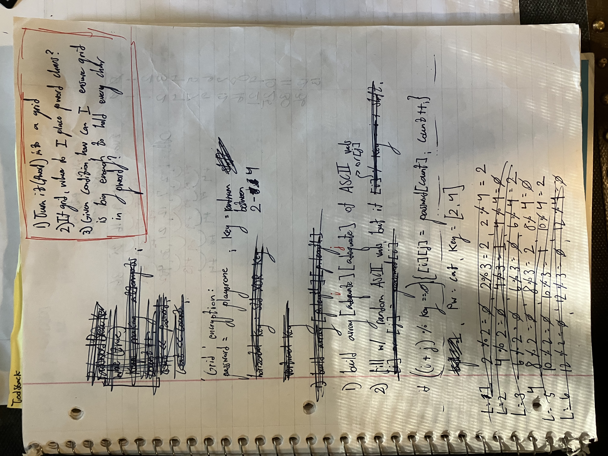
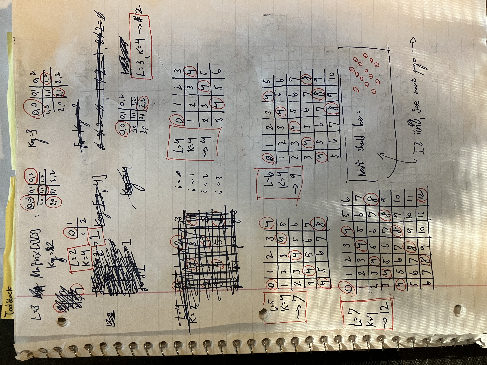
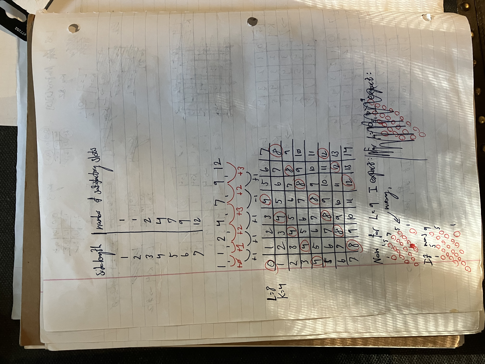
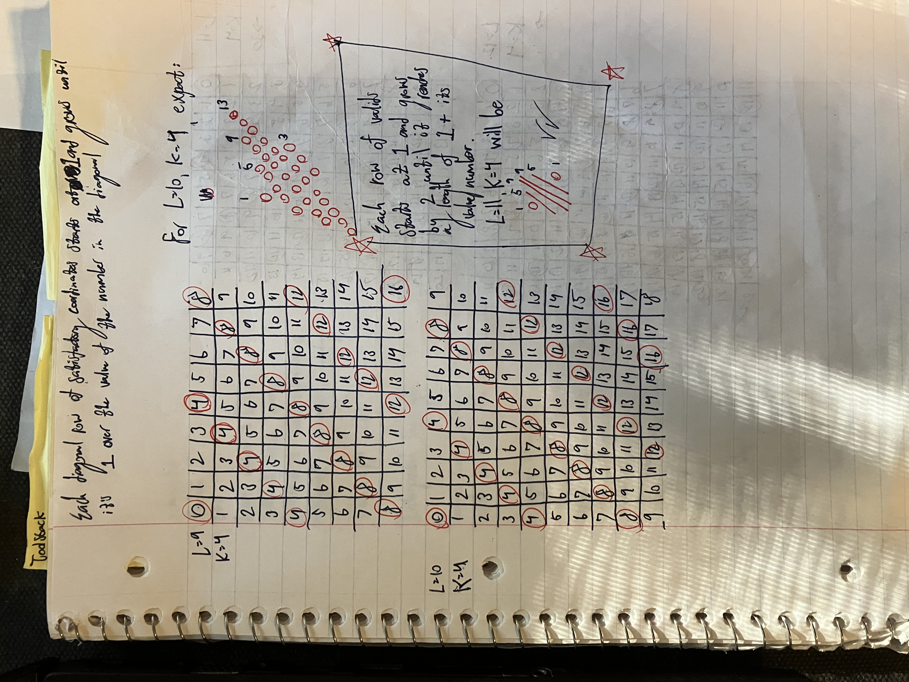
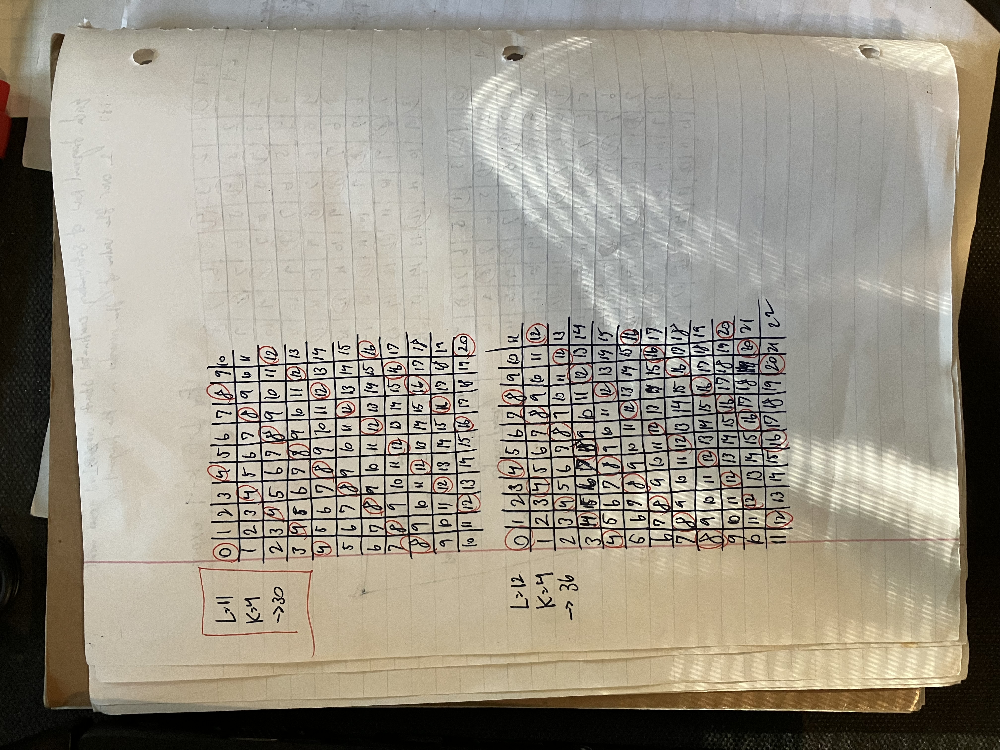
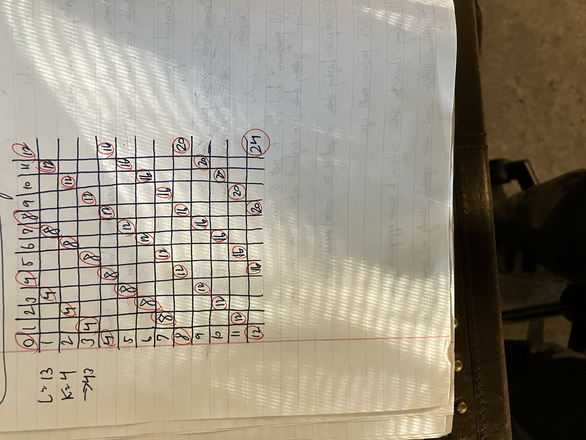
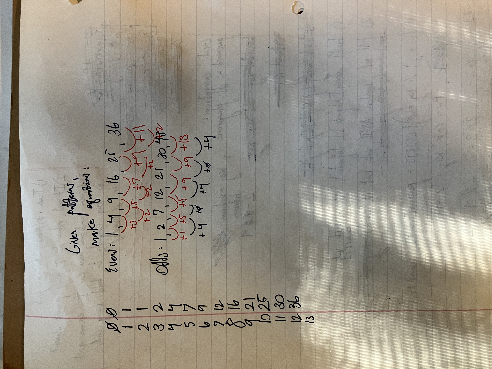

## Streams and Buffers:

Buffers- Chunks of memory that store data currently in the process of being transferred (in this case, between the terminal console and the program's input stream (std::cin)). 

Streams- abstract channels for reading and writing data.

Each stream has an associated buffer (input stream, input buffer.) Unlike buffers, streams are not physical things in your computer. A stream is an abstraction that allow you to treat the source and destination of some data uniformly: In "std::getline(std::cin, name)" the user-typed input  is the data, while th eterminal is the source and the string variable "name" (technically, its location in memory) is the destination.

[Keyboard / Terminal] → [Input Buffer] → [std::cin stream] → [name string variable]
         ▲                     ▲                  ▲                     ▲
       source              temporary         stream              destination

One must clear the input buffer after using std::cin or else the newline that is inserted when you press the enter key will linger in the buffer and will be read by future std::getline() calls as input. The line "std::cin.ignore(std::numeric_limits<std::streamsize>::max(), '\n')" clears all data in the input stream (std::cin) up until the next newline. Technically, it specifies to clear (if necessary) the maximum value of characters possible up until the next newline.
#########################################################################################################

## Project Use and Organization:

I debated between having and not having sepaerate .* files for every bit of functionality- the program loop (main, plus sign up/sign in,) encryption, and reading/writing user credentials to credentials.txt. On one hand, I wanted to practice working on a "bigger" project by having to carefully think through project structure ahead of time and divide source files up in an organized fashion. But on the other hand, I didn't want to over-engineer an incredibly basic project such as this. I ended up going the "over-engineering" route, as I've heared project structure is very important and it's best to get into good habits as early as possible. I think it will be well worth the slight increase in complexity. 

I was getting bothered with the .obj files cluttering up my project, so I consulted ChatGPT for advice on keeping a neat setup. I learned about the three main options: the "/Fo" compiler flag, setting up a .json file, and setting up a batch file. ChatGPT recommended either using a tasks.json, a build.bat file, or a combination of both. I went with setting up a tasks.json file for this first project. I understand this leaves my build process VSCode-specific, but I don't want to over-complicate things with multiple or combined build configurations for a project I'll never be exporting. I feel setting up a tasks.json file is the perfect balance between familiarizing myself with build configurations, but not over-complicating things too early on, especially since I'm already adding "extra" complexity by going further into project organization/structure when it's not necessary outside of learning how to do it and falling into good habits. 

In configuring my tasks.json file with chatGPT's guidance, I learned some neat things. Number one, it's common practice to store the executable file in ..\bin, and to keep intermediate files seperate in ..\build. Using tasks.json, I can automatically compile and build my executable by simply pressing ctrl + shift + B and selecting "Build Password Manager," which is the label I specified in tasks.json for this specific task.
#########################################################################################################

## Implementation:

----
Learned about using try/catch blocks in C++ when preventing a bug in my code that occurred when a user would input a character or string for the main menu sign up/sign in choice. The original code snippet in mainMenu() (in program_loop.cpp) was:

int action;
std::cout << "Enter '1' to sign up, or enter '2' to sign in: ";
std::cin >> action;
std::cin.ignore(std::numeric_limits<std::streamsize>::max(), '\n');
std::cout << '\n';

I changed it to:

std::string input;
std::cout << "Enter '1' to sign up, or enter '2' to sign in: ";
std::cin >> input;
std::cin.ignore(std::numeric_limits<std::streamsize::max()>, '\n');
std::cout << '\n';

int action;
try 
{
    action = std::stoi(input); // string to int
}

catch (...) // catches ANY acception
{
    std::cout << "Invalid input.\n\n";
    continue;
}

This was all for nothing when I realised I should just be using char for user input. But at least I learned about try/catch blocks.

----
I learned about XOR encryption. Say we have two 4-bit binary numbers: a = 0101, and b = 0001. When we perform an XOR operation (a ^ b), we go through each number, comparing the bits at each index, and input them into an XOR gate: the first bit in a is 0, the first bit in b is 0, in XOR, 0 and 0 yield 0. The second index of a is 1, the second index of b is 0, as inputs for an XOR gate, the result in 1. We continue the process for each index.

I had to make a random number generator (RNG) in the conventional and modern C++ style. It's compirsed of three main parts: a seed, a random number generator, and a distribution range. Here's the codeblock in it's entirety:

std::random_device rd;
std::mt19937 gen(rd());
std::uniform_int_distribution<> dist(1, 10);

int random_num = dist(gen);

Line one creates an object of the random_device class called "rd." When called, rd asks the OS to randomly select a value from the pool of hardware entropy values, which is then used in line two to seed our "random number engine," which in this case is a specific engine called a "Mersenne Twister." The twister uses the seed value as a  'key,' generating an array of 624 unsigned 32-bit numbers based on it. It then takes a value, tweaks it, and returns it. This value is then used by the uniform_int_distribution
obj made in line 3, which takes the value uses an algorithm to bring it down to a number in the desired range (1 thorugh 10, in my case.) The algorithm looks something like this:

int uniform_int(typename engine, int a, int b) {
    int range = b - a + 1;
    uint32_t engine_range = engine.max() - engine.min() + 1;
    uint32_t bucket_size = engine_range / range;
    uint32_t limit = bucket_size * range;

    uint32_t raw;
    do {
        raw = engine() - engine.min();
    } while (raw >= limit);  // Reject biased values

    return a + (raw / bucket_size);
}

So in summary, here are the two main steps: 
1) In "std::mt19937 gen(rd());", "rd()" yields a randomly selected random hardware entropy value that is used to seed std::mt19937 gen(), a random number engine that produces an array of 624 32-bit unsigned integers and takes one of those values, tweaks it, and returns it.

2) The uniform_int_distribution obj dist() algorithmically "squashes" that value down to a number that falls in the range passed into it ((1,10), in my case.)

----
I Implementated my own encryption function, called "grid." Bassically, the function takes user input and hides it whithin a two-dimensional vector of random characters. It follows a two step process (for the most part) like this:

1) A square grid is built, made up of a two-dimensional vector of characters.
2) As said grid is built, the user's password is placed character-by-character in every location/coordinate in the grid (grid[i][j]) that meets the condition ((i + j) % key == 0), where key is a random number in the range [2, 4].

The condition is just a random one I came up with, and ensuring the grid had enough locations that satisfied the condition to fit the user's entire password was a challenge. Say we have a 3x3 grid, and the users password is "Computer." Given "Computer" is eight characters long, we need at least eight locations in our 3x3 grid to satisfy our condition of ((i + j) % key == 0). When the key = 2 (the lowest value it can be,) there are four locations that satisfy the condition, those locations are: (0, 0), (0, 2), (1, 1), and (2, 0). But when key = 4 (the highest value it can be,) there are only two locations in the grid that satisfy the condition, those locations being (0, 0) and (2, 2). Even though a 3x3 grid could fit the password "Computer" inside it in general, it couldn't do so if it was only placing in the characters of the password in one at a time at locations that satisfy the condition. With pen and paper, I started going through different grid sizes using the highest value of key (which is 4) to see how the dimensions of the square grid affected the number of locations that satisfied the condition. Here are pictures of the process: 

As you can see, I became aware of a pattern in the lengths of the "diagonals" of satisfactory locations that formed in the grid as its dimensions were increased, but I couldn't yet find a way to map it into code. I also tried finding patterns in the way the number of satisfactory locations grew along side the grid'sdimensions, and this led me to my solution. I noticed an even side length would yield its length^2 many satisfactory values, but also found that there was no pattern I knew how to work with in regards to how the number of satisfactory locations grew with odd side lengths. I decided to always have a grid of even side length. With this simple rule, I then made sure the grid was large enough to have enough satisfactory locations to fit all the characters of the user's password by counting the number of increments needed to get a sidelength that results in more satisfactory locations in the grid than characters in the user's password.

In the grid-encrypted output, I noticed it was very obvious what the original password was, given most randomly-assigned characters were obscure ASCII symbols, and the characters of the users password were often the only alphabetical characters in the grid. My solution was to pass the user password through my caesarEncryption() function before building the encrypted grid. 

